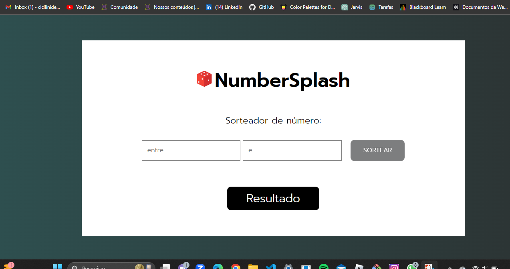

# 🎲 NumberSplash

O NumberSplash é um sorteador de números simples que permite gerar números aleatórios dentro de um intervalo especificado. É uma ferramenta útil para tomada de decisões ou sorteios em diversos contextos.

## Funcionalidades

- **Sorteio de Números:** Insira dois números inteiros nos campos de entrada e clique no botão "SORTEAR" para gerar um número aleatório dentro do intervalo especificado.

## Uso

1. Insira um número menor no primeiro campo de entrada.
2. Insira um número maior no segundo campo de entrada.
3. Clique no botão "SORTEAR" para gerar um número aleatório dentro do intervalo especificado.
4. O resultado do sorteio será exibido na seção "Resultado".

## Como Começar

Para começar a usar o NumberSplash, siga estas etapas:

1. Abra a página no seu navegador.
2. Insira os números desejados nos campos de entrada.
3. Clique no botão "SORTEAR" para gerar um número aleatório.

## Tecnologias Utilizadas

- HTML: Para a estrutura da página.
- CSS: Para estilização.
- JavaScript: Para funcionalidades interativas e parte lógica.

